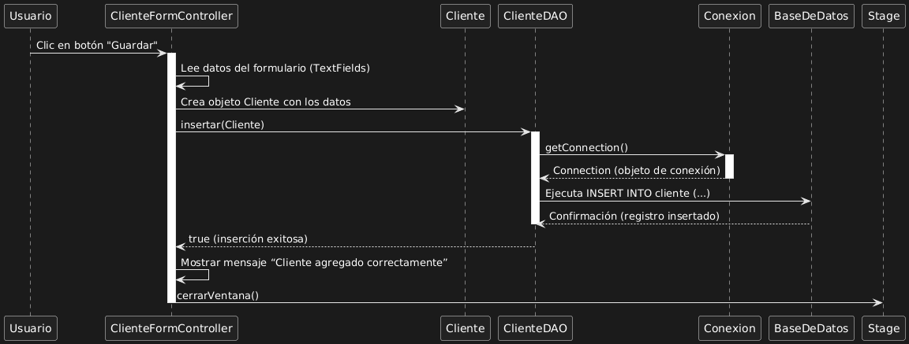

# Descripción de la Aplicación -- Módulo de Registro de Clientes

## Introducción

Esta aplicación forma parte del sistema de gestión de clientes de la
Academia **Dev Senior**.
El objetivo del módulo es permitir el **registro de nuevos clientes** a
través de un formulario interactivo, conectado a una base de datos
relacional mediante JDBC.

------------------------------------------------------------------------

## Arquitectura General

La aplicación sigue el patrón **MVC (Modelo-Vista-Controlador)**, con
las siguientes capas:

-   **Vista (ClienteForm.fxml)**: interfaz gráfica donde el usuario
    ingresa los datos del cliente.
-   **Controlador (ClienteFormController.java)**: gestiona los eventos
    del formulario y coordina la lógica del proceso.
-   **Modelo (Cliente.java)**: clase que representa la entidad `Cliente`
    con sus atributos y métodos.
-   **DAO (ClienteDAO.java)**: clase encargada de realizar las
    operaciones de acceso a la base de datos (CRUD).
-   **Conexión (Conexion.java)**: establece y administra la conexión con
    la base de datos.

------------------------------------------------------------------------

## Flujo de Registro de un Cliente

1.  El **usuario** hace clic en el botón **"Guardar"** en la interfaz.
2.  El **controlador** lee los datos ingresados en los campos de texto
    (`TextFields`).
3.  Se crea un objeto `Cliente` con los datos capturados.
4.  El controlador llama al método `insertar(Cliente)` de la clase
    `ClienteDAO`.
5.  `ClienteDAO` obtiene una conexión a la base de datos mediante
    `Conexion`.
6.  Se ejecuta la sentencia SQL `INSERT INTO cliente (...)`.
7.  Si la inserción es exitosa, el DAO devuelve `true`.
8.  El controlador muestra el mensaje **"Cliente agregado
    correctamente"** y cierra la ventana.

------------------------------------------------------------------------

## Diagrama de Secuencia

El siguiente diagrama ilustra la interacción entre los componentes del
sistema durante el proceso de registro de un cliente:

------------------------------------------------------------------------

## Tecnologías Utilizadas

-   **Java 17**
-   **JavaFX** para la interfaz gráfica
-   **JDBC** para la conexión con la base de datos
-   **MySQL** como sistema gestor de base de datos
-   **DAO Pattern** para separar la lógica de acceso a datos

------------------------------------------------------------------------

##   Resultado de la implementación

Al finalizar el proceso, el sistema puede:
- Insertar correctamente los datos del nuevo cliente en la base de
datos.
- Notificar al usuario del éxito de la operación.
- Mantener una arquitectura modular, clara y mantenible.
